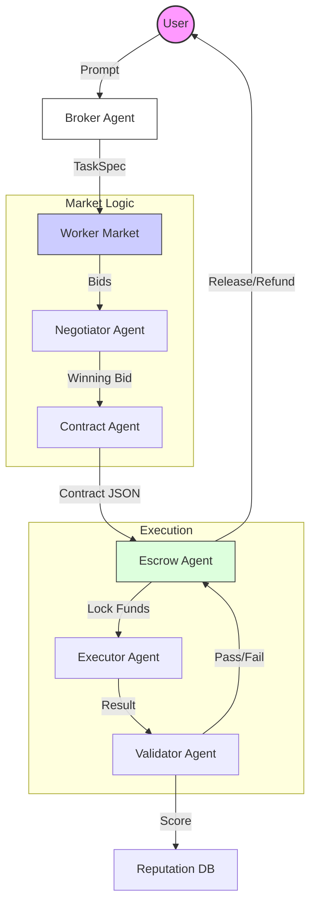

# 🤖 AgentBazaar: Emergent Skill Marketplace

 

**AgentBazaar** is a local multi-agent simulation where AI agents autonomously trade skills. It simulates a gig economy where agents post tasks, bid for work, negotiate contracts, execute deliverables, and validate results—all without human intervention.

Built using the **Agno Framework** (formerly Phidata) for orchestration and **Ollama** for local LLM inference.

## 🏗 Architecture

The system follows a strict linear orchestration flow designed to mimic high-stakes contracting environments:



## 🧠 Components & Tech Matrix

### 1. Agents (Agno Framework)
We utilize Agno's `Agent` class to define specialized personas.
*   **Broker**: Structurers messy user prompts into strict JSON `TaskSpec`.
*   **Workers**: 3 distinct personas (Fast/Cheap, Premium, Balanced) that generate competitive bids.
*   **Negotiator**: Implements a scoring algorithm (`price` vs `reputation` vs `confidence`) and runs a multi-turn negotiation loop to drive down prices.
*   **Validator**: Acts as a strict QA, checking output against contract acceptance criteria.

### 2. LLM Engine (Ollama)
The system is built to run 100% locally.
*   **Model**: `llama3.2:latest` (Swappable in `src/agents/*.py`)
*   **Inference**: Zero-latency local calls via standard Ollama API.

### 3. State & Persistence
*   **Escrow Ledger**: Simulated financial locking mechanism (`json` based).
*   **Reputation DB**: Tracks long-term agent performance (Success Rate, Avg Score).

## 🚀 Getting Started

### Prerequisites
*   Python 3.9+
*   [Ollama](https://ollama.ai) installed and running.

### Installation

1.  **Clone the repository**
2.  **Install Dependencies**
    ```bash
    pip install -r requirements.txt
    ```
3.  **Pull the Model**
    ```bash
    ollama pull llama3.2:latest
    ```

### Running the Simulation
Launch the visual dashboard:
```bash
streamlit run ui/app.py
```

## 💡 How It Works

1.  **Task Ingestion**: You post "Write a clear Python function for finding primes".
2.  **Bidding War**:
    *   *Worker A (Cheap)* bids $40, Low Confidence.
    *   *Worker B (Premium)* bids $120, High Confidence.
3.  **Negotiation**: The Negotiator scores bids. It might challenge Worker B to lower their price to $100.
4.  **Contracting**: A formal JSON contract is generated with "Acceptance Tests" derived from your prompt.
5.  **Execution**: The winning agent writes the code.
6.  **Validation**: The Validator runs a rubric check. If it passes, Escrow releases funds and Reputation increases.

## 🛠 Building with Agno

This project demonstrates key Agno patterns:

*   **Structured Outputs**: Using `output_schema` to force LLMs to reply in valid Pydantic models (crucial for system reliability).
*   **Role Playing**: Assigning distinct `instructions` to agents to create "Personas" that behave differently.
*   **Orchestration**: Managing state hand-offs between multiple agents in a Pythonic workflow.

## 🔮 Future Use Cases
*   **Automated DevOps**: Agents bidding on ticket resolution.
*   **Content Factories**: SEO agents, Writers, and Editors negotiating details.
*   **Resource Allocation**: Autonomous trading bots negotiating API usage.

### Output Screenshots


